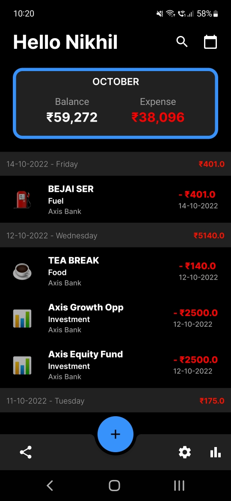
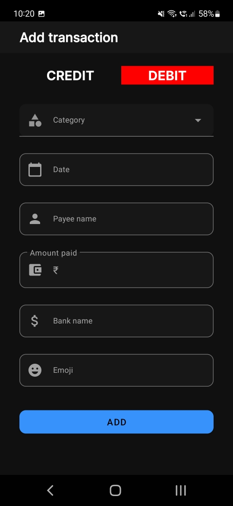
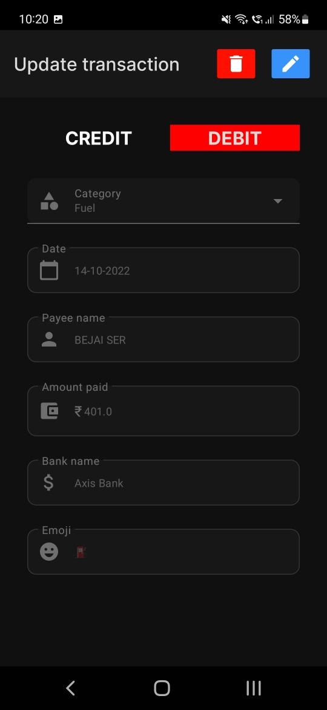
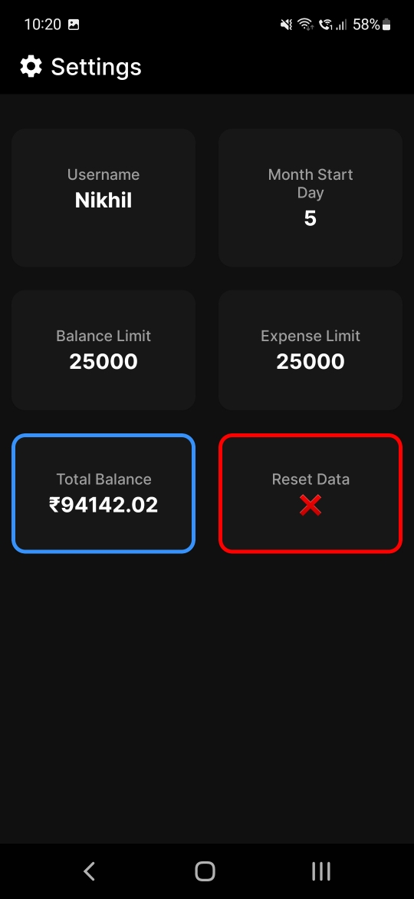
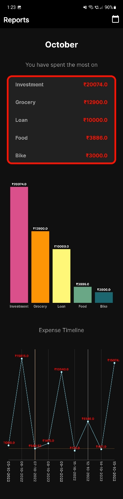

> # Expense Tracker Android
- A simple expense tracker app that automatically adds transactions by reading your SMS inbox.
- Built using Java, Android Material Design library and SQLite.

 

 ## Permissions required
- **To send and view SMS** ( Your data is not tracked or saved in any way )

 

 ## Works for 
    - AXIS Bank
    - HDFC Bank
    - SBI Bank
    - ICICI Bank

- Currently only UPI transactions are tracked. Future versions will support card transactions, investment SMS's etc.  

 

 ## **Download here**
><a id="raw-url" href="https://github.com/Nikhiladiga/expense-tracker/releases">Download APK</a>

 

## Screenshots

### Main dashboard

### Add transaction

### Update transaction

### Settings

### Reports
